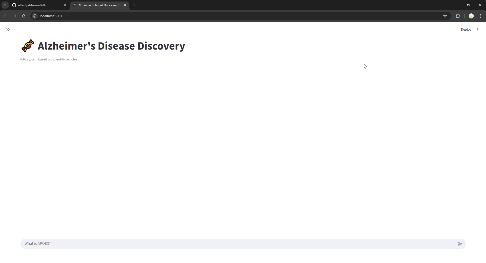
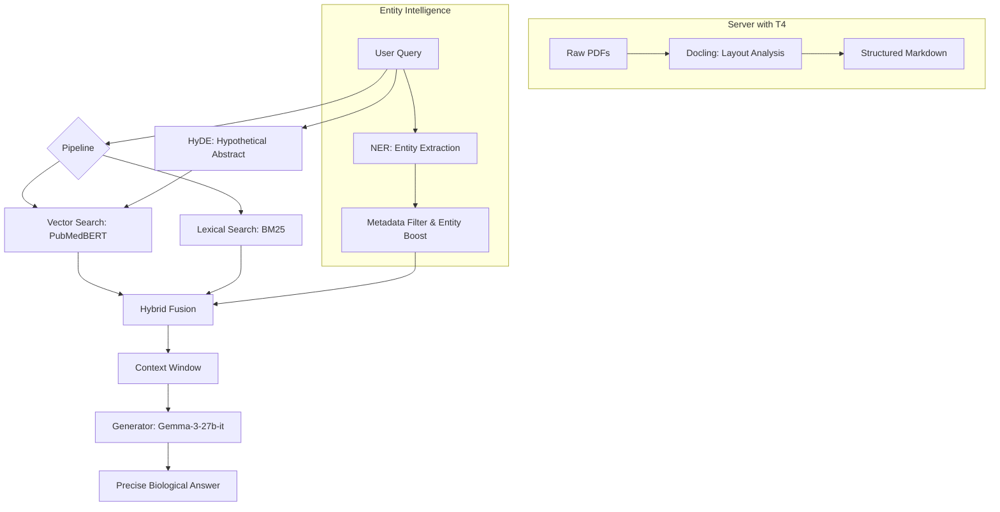

<div align="center">

# AlzheimerRAG 🧬 Precision Biomedical Retrieval

[](https://www.python.org/)
[](https://ds4sd.github.io/docling/)
[]()
[](https://huggingface.co/datasets/effes3/AlzheimerDB)
[](https://www.shellscript.sh/)
[](https://streamlit.io/)

**A high-precision search tool for biomedical literature**  
Solves the **specificity-recall trade-off** problem (e.g., distinguishing between *APOE3* and *APOE4*) using metadata-based re-ranking and a hybrid search architecture

[Demo](#-demo-quick-look) • [Quick start](#-quick-start) • [Architecture](#-retrieval-architecture) • [Results](#-performance-evaluation-results10)

</div>

---

## 🎬 Demo: Quick Look

  
*Query → Retrieved Papers → Entity-Aware Highlighting*

---

## 🚀 Quick Start

### 1. Prerequisites
*   **API Keys:** Access to OpenRouter (Llama-3/Grok/Qwen and etc. models) is required
*   **Google AI:** Be careful with Gemma — sometimes it doesn't work via OpenRouter API key from Russia, but you can always switch to another model in the `.env` file
 
### 2. Configuration
```bash
cp .env.example .env
```
Add your keys to `.env`:
```env
OPENROUTER_API_KEY="sk-or-v1-..."
RAG_MODEL_NAME="arcee-ai/trinity-mini:free"
```

### 3. Installation & Execution
I use `uv` for deterministic environment assembly

**Option A: via `uv` (Recommended)**
```bash
git clone https://github.com/effes3/alzheimerRAG.git
cd alzheimerRAG
uv sync
cp .env.example .env # After copying it change OpenRouter API key to yours
sh scripts/download_db.sh # Automatic loading of vector database from Hugging Face (64MB)
uv run streamlit run src/app.py
```

<details>
<summary><strong>Option B: via `pip` (Slow)</strong></summary>

```bash
git clone https://github.com/effes3/alzheimerRAG.git
cd alzheimerRAG
python -m venv .venv
source .venv/bin/activate  # Windows: .\.venv\Scripts\activate
pip install -r requirements.txt
cp .env.example .env # After copying it change OpenRouter API key to yours
sh scripts/download_db.sh # Automatic loading of vector database from Hugging Face (64MB)
streamlit run src/app.py
```
</details>

---

## 📂 Project Structure
<details>
<summary>Show project tree</summary>

```bash
alzheimerRAG/
├── data/           # PDFs, extracted texts, and entity annotations
├── scripts/        # Data processing and EDA scripts
├── src/            # Main application and retriever logic
├── results_pdf2text/        # Reports and evaluation results
├── README.md
├── requirements.txt
└── pyproject.toml
```
</details>

---

## 🧬 Retrieval Architecture



Hybrid search combines **Semantic Density** and **Lexical Exactness**, enhanced by the **Metadata Injection** mechanism

### Scoring Logic
The formula for the final document score ($Score(d)$):

$$
Score(d) = \underbrace{\left[ \alpha \left(1 - \frac{S_{\text{vec}}}{Max_{\text{vec}}}\right) + (1-\alpha) \left(\frac{S_{\text{bm25}}}{Max_{\text{bm25}}}\right) \right]}_{\text{Hybrid Base Score}} \times \underbrace{\text{Boost}(Entities)}_{\text{Metadata Multiplier}}
$$

| Component | Implementation | Why is it needed? |
| :--- | :--- | :--- |
| **S_vec** 🟢 | `NeuML/pubmedbert-base-embeddings` | Captures conceptual similarity ("meaning") |
| **S_bm25** 🔵 | **BM25Okapi** | Ensures exact term matching |
| **Boost** ⚡ | Metadata Injection | Multiplies the score if entities from the query are present in the metadata |

---

## 📊 Performance Evaluation (Results@10)

The evaluation dataset was synthetically generated using a "LLM-as-a-Researcher" pipeline (via NotebookLM). The goal was to create complex, multi-document queries that require cross-referencing information

You can find this dataset in code from `evaluate.py`

**Infrastructure:** Judge: `gpt-4o-mini` | Generator: `gemma-3-27b-it` | HyDE and NER from Query: `google/gemma-3n-e4b-it:free`

> results of RAG on DB created by cleaning texts from PDFs via LLM
> 
| Architecture | Faithfulness | Relevancy | Precision | Recall | Latency (s) |
| :--- | :---: | :---: | :---: | :---: | :---: |
| **Vector + Entity Boost** 🏆 | **0.816** | **0.410** | **0.706** | **0.579** | **9.80** |
| Hybrid + Entity Boost | 0.800 | 0.367 | 0.706 | 0.579 | 11.25 |
| Hybrid + HyDE + Entity Boost | 0.777 | 0.310 | 0.596 | 0.421 | 14.79 |

**Key insights:**
1. **Simplicity wins:** The Vector + Entity Boost configuration showed the best faithfulness with minimal latency
2. **HyDE is noisy:** Using hypothetical embeddings worsened metrics due to hallucinations in the biomedical context
3. **Recall Ceiling:** The identical recall ceiling indicates a bottleneck in the ingestion stage rather than retrieval

But after implementing **Docling** to process PDFs, the system achieved a massive leap in **Faithfulness** and **Recall** with same **Infrastructure**

> results of RAG on DB created by .md files via Docling
> 
| Architecture | Faithfulness | Relevancy | Recall | Latency (s) |
| :--- | :---: | :---: | :---: | :---: |
| **Vector + Entity Boost** 🏆 | 0.935 | **0.709** | 0.789 | **8.50** |
| **Hybrid + Entity Boost** | 0.938 | 0.682 | 0.778 | 14.94 |
| **Hybrid + HyDE + Entity Boost** 🏆 | **0.956** | 0.614 | **0.895** | 19.33 |

**Key insights:**
1.  **HyDE for Discovery:** Using HyDE (Hypothetical Document Embeddings) increased **Recall to ~90%**, making it the best mode for identifying hidden drug targets
2.  **Docling Effect:** Faithfulness scores above **0.93** indicate that the LLM has almost stopped hallucinating, as it now receives perfectly structured table data
3.  **The Specificity Win:** Metadata-based Entity Boosting ensures that *APOE4* related queries prioritize chunks explicitly tagged with that isoform

---

## 🔮 Future Roadmap
*   🧪 **Domain-Specific Re-ranking:** Integrating `cross-encoders` trained on PubMed to further refine the Top-K
*   🌐 **GraphRAG:** Transitioning to a knowledge-graph-based retrieval to map complex gene-protein-disease pathways
*   🛠️ **Automated NER Pipeline:** Full integration of the Entity Extraction step into the ingestion workflow via [MARCUS](https://chemrxiv.org/engage/chemrxiv/article-details/686b86cb1a8f9bdab5017104) or specialized LLMs

---

## ⚠️ Limitations
<details>
<summary>Click to expand</summary>

*   **Pilot Dataset Scale:** The current evaluation was performed on a high-quality pilot network of 24 papers. While the architecture is scalable, behavior may shift when moving to million-scale document collections (requiring HNSW or DiskANN indexing)
*   **Distributed Ingestion Workflow:** To maintain high performance without local GPU costs, document parsing (via Docling) is currently performed in a Google Colab environment. A unified, server-side ingestion API is planned for the next release

</details>

---

## 👨‍🔬 About the Author
I am a chemist by education @ HSE who switched to ML engineering. My goal is to create tools that automate science

*   **Olympic background:** Multiple winner of chemistry competitions, 5 sessions at the Sirius Educational Centre
*   **ML Experience:** Graduate of T-Bank's ML programme (top 20 out of 600+ participants). The only chemist among developers from BigTech
*   **Domain Expertise:** I understand the difference between protein isoforms not only in terms of text, but also in terms of biological function


